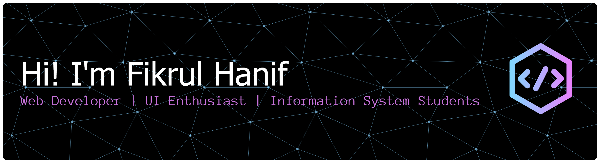

<!-- ============================================ -->
<!-- HEADER BANNER -->
<!-- ============================================ -->

 

<!-- ============================================ -->
<!-- PROFILE VIEWS & BADGES -->
<!-- ============================================ -->

  
  
  

<!-- ============================================ -->
<!-- GLOWING DIVIDER -->
<!-- ============================================ -->

##  About Me

Hi there! I'm **Fikrul Hanif Alghazali**, a passionate Information Systems student with a deep interest in web development and user experience design. I love creating modern, interactive web applications that not only look great but also provide seamless user experiences.

My journey in tech started with curiosity about how websites work, and it has evolved into a passion for building full-stack applications. I'm constantly exploring new technologies and frameworks to expand my skill set and stay up-to-date with industry trends.

**What I'm passionate about:**

- Building responsive and interactive web applications
- Creating intuitive user interfaces and experiences
- Learning modern frontend frameworks and libraries
- Backend development with PHP frameworks
- Mobile app development with Flutter

**Currently:**

- Studying Information Systems
- Working on personal projects to sharpen my skills
- Exploring modern web technologies and best practices
- Open to collaboration and learning opportunities

<!-- ============================================ -->
<!-- MEME IMAGES -->
<!-- ============================================ -->

 

<table>
  <tr>
    <td align="center" width="33%">
      
    </td>
    <td align="center" width="33%">
      
    </td>
    <td align="center" width="33%">
      
    </td>
  </tr>
</table>

 

<!-- ============================================ -->
<!-- GLOWING DIVIDER -->
<!-- ============================================ -->

##  Tech Stack

<table align="center">
  <tr>
    <td align="center" width="25%">
      <h3>Languages : </h3>
    </td>
    <td align="center" width="75%">
      
      
      
      
      
      
    </td>
  </tr>
  <tr>
    <td align="center">
      <h3>Frameworks : </h3>
    </td>
    <td align="center">
      
       
      
    </td>
  </tr>
  <tr>
    <td align="center">
      <h3>Libraries : </h3>
    </td>
    <td align="center">
      
      
      
      
      
      
      
      
      
    </td>
  </tr>
  <tr>
    <td align="center">
      <h3>Databases : </h3>
    </td>
    <td align="center">
      
    </td>
  </tr>
  <tr>
    <td align="center">
      <h3>Tools : </h3>
    </td>
    <td align="center">
      
       
      
      
    </td>
  </tr>
</table>

<!-- ============================================ -->
<!-- GLOWING DIVIDER -->
<!-- ============================================ -->

##  Connect With Me

  
  
  
  
  

<!-- ============================================ -->
<!-- GLOWING DIVIDER -->
<!-- ============================================ -->

##  GitHub Statistics

  
  

  

<!-- ============================================ -->
<!-- GLOWING DIVIDER -->
<!-- ============================================ -->

##  Trophies & Achievements

  

<!-- ============================================ -->
<!-- GLOWING DIVIDER -->
<!-- ============================================ -->

##  Activity & Contribution

<picture>
  <source media="(prefers-color-scheme: dark)" srcset="https://raw.githubusercontent.com/fikrulhanif/fikrulhanif/output/github-contribution-grid-snake-dark.svg">
  <source media="(prefers-color-scheme: light)" srcset="https://raw.githubusercontent.com/fikrulhanif/fikrulhanif/output/github-contribution-grid-snake.svg">
  
</picture>

  

<picture>
  <source media="(prefers-color-scheme: dark)" srcset="https://raw.githubusercontent.com/fikrulhanif/fikrulhanif/pacman-output/pacman-contribution-graph-dark.svg">
  <source media="(prefers-color-scheme: light)" srcset="https://raw.githubusercontent.com/fikrulhanif/fikrulhanif/pacman-output/pacman-contribution-graph.svg">
  
</picture>

<!-- ============================================ -->
<!-- GLOWING DIVIDER -->
<!-- ============================================ -->

<!-- ============================================ -->
<!-- FOOTER -->
<!-- ============================================ -->

 

### Thanks for visiting! Feel free to reach out if you want to collaborate or just chat about tech.

 

